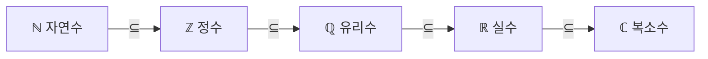

# 수의 집합 (N, Z, Q)

집합론에서 자주 쓰는 대표적인 수 체계들. 각각 [[set-theory]]의 조건제시법으로 정의된다.

## 자연수 ℕ (Natural numbers)
$$
\mathbb{N} = \{1, 2, 3, 4, \dots\}
$$

- 노트 기준으로 **1부터 시작** (0 미포함).
- ⚠️ **관례 주의**: 0을 자연수에 포함하는 정의(`{0,1,2,…}`)도 흔하다. 분야·교재마다 다르므로
  사용하는 책의 정의를 확인할 것.

## 정수 ℤ (Integers)
$$
\mathbb{Z} = \{\dots, -3, -2, -1, 0, 1, 2, 3, \dots\}
$$

- 자연수에 0과 음의 정수를 더한 집합. `ℕ ⊆ ℤ`.

## 유리수 ℚ (Rational numbers)
$$
\mathbb{Q} = \left\{ \frac{p}{q} \;\middle|\; p, q \in \mathbb{Z},\ q \neq 0 \right\}
$$

- **두 정수의 비(분수)**로 나타낼 수 있는 수. `ℤ ⊆ ℚ` (예: `5 = 5/1`).
- 조건 `q ≠ 0`은 **분모**에 붙는다 — 0으로 나눌 수 없기 때문. (2026-06-21 사용자 확인 완료)

## 실수 ℝ (Real numbers)
$$
\mathbb{R} = \{\text{real numbers}\}
$$

- 유리수에 무리수(√2, π 등)를 더한 수 전체. `ℚ ⊆ ℝ`.
- 무리수가 실재함을 보이는 대표 예시 → [[irrationality-of-sqrt2]] (√2 ∉ ℚ).

## 복소수 ℂ (Complex numbers)
$$
\mathbb{C} = \{\text{complex numbers}\} = \{ a + bi \mid a, b \in \mathbb{R},\ i^2 = -1 \}
$$

- 실수에 허수 단위 `i`를 더한 수 전체. `ℝ ⊆ ℂ`.

## 포함 관계
$$
\mathbb{N} \subseteq \mathbb{Z} \subseteq \mathbb{Q} \subseteq \mathbb{R} \subseteq \mathbb{C}
$$

## 관련
- 집합의 정의·조건제시법 → [[set-theory]]
- 각 집합의 부분집합 전체 → [[power-set]]
- √2가 ℚ에 없음을 증명 → [[irrationality-of-sqrt2]]

## 출처
- [[set-theory-2026-06-21]] (손글씨 공부 노트, raw/transcripts)
